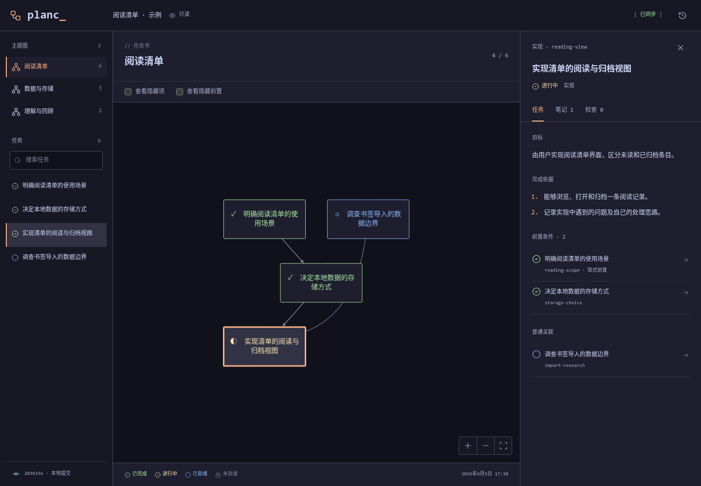

# planc

[](LICENSE)   <br>

**planc** 是一个项目级 AI Skill，用于共同制定计划、由你亲自实现，并持续保持对项目的理解。

| English                | Simplified Chinese |
| ---------------------- | ------------------ |
| [English](./README.md) | 简体中文           |

与 Agent 讨论目标和取舍，把共同采纳的工作写成任务图，然后亲自实现项目。把自己的笔记留在计划旁边；当你请求检查时，Agent 核对结果并记录依据。



## 它能做什么

- **共同制定计划。** 查阅代码、讨论候选方向，只记录双方已经采纳的工作。
- **由用户执行。** 你编写项目代码、执行命令、记录自己的理解；Agent 解释、追问，并提供教学示例。
- **逐步显露任务。** 默认显示已完成、进行中和已就绪的事项；前置完成后，后继任务自然显露。
- **跨主题共享。** 同一任务可以出现在多个主题图中，共享内容和状态。
- **可追溯的检查。** 完成状态关联检查记录；你了解疑点后仍可确认完成，Agent 的不同意见会被保留。
- **本地历史。** 计划和 Markdown 保存在独立的 `.plan` Git 仓库中，文件保存后只读网页自动更新。

### 任务类型

| 类型 | 用途                     | 完成依据                 |
| ---- | ------------------------ | ------------------------ |
| 实现 | 亲自构建项目的一部分     | 代码、你的笔记和执行结果 |
| 理解 | 用自己的话解释项目       | 你的说明与尚存的疑问     |
| 调查 | 在选择方向前建立事实依据 | 资料、观察与调查结论     |
| 决策 | 选择方案并记录取舍       | 选择、约束与理由         |

## 安装

**必须局部安装到项目内。** 只在你希望采用这种协作方式的项目中安装 planc，不要安装到用户主目录下的全局技能目录，也不要使用全局 Skill 安装器。

环境要求：**Node.js 22+**、**Git**，以及已安装的 Codex 或 Claude Code 客户端。以下命令适用于 POSIX shell（Linux、macOS 或 WSL）。Skill 已携带 CLI 和构建好的页面，目标项目无需运行 `npm install`，也不需要构建前端。

先创建一个新的测试项目：

```sh
mkdir -p planc-test
cd planc-test
git init
```

使用已有项目时，直接进入项目根目录。然后选择下面对应客户端的安装命令；完整 Skill 复制到项目后，临时克隆目录会自动清理。

### Codex

在目标项目根目录执行：

```sh
(
  set -eu
  planc_source="$(mktemp -d)"
  trap 'rm -rf "$planc_source"' EXIT
  git clone --depth 1 https://github.com/Bli-AIk/planc.git "$planc_source"
  node "$planc_source/scripts/install.mjs" codex .
  node .agents/skills/planc/scripts/planc.cjs init .
  node .agents/skills/planc/scripts/planc.cjs validate .
)
```

安装结果是 `.agents/skills/planc/SKILL.md` 及其配套文件。在此项目中启动 `codex`，通过 `/skills` 查看，或直接在对话中调用：

```text
$planc 帮我理解这个项目，并共同制定下一项改动的任务书。实现由我来完成。
```

在同一项目目录启动本地视图：

```sh
node .agents/skills/planc/scripts/planc.cjs serve .
```

### Claude Code

在目标项目根目录执行：

```sh
(
  set -eu
  planc_source="$(mktemp -d)"
  trap 'rm -rf "$planc_source"' EXIT
  git clone --depth 1 https://github.com/Bli-AIk/planc.git "$planc_source"
  node "$planc_source/scripts/install.mjs" claude .
  node .claude/skills/planc/scripts/planc.cjs init .
  node .claude/skills/planc/scripts/planc.cjs validate .
)
```

安装结果是 `.claude/skills/planc/SKILL.md` 及其配套文件。在此项目中启动 `claude`，然后调用：

```text
/planc 帮我理解这个项目，并共同制定下一项改动的任务书。实现由我来完成。
```

在同一项目目录启动本地视图：

```sh
node .claude/skills/planc/scripts/planc.cjs serve .
```

安装路径依据官方的 [Codex Skills 文档](https://developers.openai.com/codex/skills/) 和 [Claude Code Skills 文档](https://code.claude.com/docs/en/skills#where-skills-live)。新建技能目录后若未识别，请从项目根目录重新启动客户端。

安装器发现已有安装时会报错并保留原文件，不会覆盖；它也会拒绝在用户主目录安装，或通过符号链接重定向目标目录。在同一项目安装两种客户端，会得到两份局部 Skill，它们共用同一份 `.plan` 数据。

## 使用

服务会打印本地地址，通常为 `http://127.0.0.1:4317/`；端口被占用时自动选择后续端口，按 Ctrl-C 停止。新初始化的任务书为空，先与 Agent 共同采纳第一批任务。

### 推进过程

1. 提出目标或当前困难。Agent 阅读相关代码与笔记，补充事实并参与讨论。
2. 共同采纳任务与取舍。未选择的候选方向保留在讨论材料中，不会被预先编排成完整的隐藏实现路线。
3. 选择任务并亲自执行，在 Markdown 中记录自己的理解和疑问。需要时随时提问。
4. 报告完成并请求检查。Agent 核查代码、笔记与已有执行结果，记录实际检查了什么。
5. 有疑点时，先讨论任务拆分、前置关系和完成依据。结构调整保留理由和历史。

你了解尚存的疑点后，仍明确要求按完成处理时，会记录为 **用户确认完成** 并保留 Agent 的异议，后继正常激活。后续发现疑点不会自动撤销已完成任务，也不会级联撤销整张计划。

### 文件

```text
your-project/
  .agents/skills/planc/    # 选择 Codex 时安装
  .claude/skills/planc/    # 选择 Claude Code 时安装
  .gitignore              # init 追加 /.plan/
  .plan/
    .git/                 # 独立本地历史，无默认远程
    plan.json             # 任务、关系、主题图、检查、结构变更
    notes/
      user/               # 你的笔记原文
      agent/              # 独立署名的 Agent 讨论
```

任务仅保存 `not_started`、`in_progress` 或 `completed`。就绪情况依据全部前置条件计算，隐式前置和跨图前置同样参与；普通关联不影响激活。网页可以显示隐藏任务和隐式连线，任务详情始终列出所有前置条件。

图先按完整主题布局再过滤。状态变化保持节点位置，文件更新保留选择和视口。损坏 JSON、无效引用或笔记错误会显示错误，并保留上一次有效视图；该回退只在当前服务进程内保留。

详见[格式参考](skill/planc/references/format.md)、[JSON Schema](src/schema.json) 和[示例任务书](examples/plan.json)。示例和截图中的项目笔记均为虚构数据，不是学习效果的证据。

### 配套工具

每轮有效更新后执行校验和 checkpoint。Codex 安装对应的命令为：

```sh
node .agents/skills/planc/scripts/planc.cjs validate .
node .agents/skills/planc/scripts/planc.cjs checkpoint . -m "明确本轮完成依据"
```

Claude Code 安装请将 `.agents` 换成 `.claude`。四个入口分别是 `init`、`validate`、`serve` 和 `checkpoint`。重复初始化保留已有数据；没有改动时不会创建空提交。详见[工具参考](skill/planc/references/tools.md)。

## 协作边界

Skill 不交付你当前项目任务的实现或补丁。它可以解释、调查、检查并提供教学示例，不会自动改写你的 Markdown 原文。

安装完成后，初始化追加外层 `.gitignore` 是唯一写入例外。之后的计划更新只写 `.plan`；项目构建、测试等操作由你执行。服务仅监听 `127.0.0.1`，没有写入接口，不暴露 Git 内部文件或项目源码。路径校验用于落实协作约定，Skill 文本不是宿主级安全沙箱。

工程检查仅验证可观察的行为。真实使用是否帮助理解项目、保持掌控和创作兴趣，由你独立判断。

## 开发

在 planc 源码仓库中运行：

```sh
npm ci
npm run check:md
npm run check
npx playwright install chromium
npm run test:browser
```

前端使用 TypeScript、Cytoscape.js、dagre、Markdown-it 和 Lucide。视觉风格参考 [OpenCode 的终端式设计](https://getdesign.md/opencode.ai/design-md)，配色采用 [Catppuccin Mocha](https://github.com/catppuccin/palette)，详见 [DESIGN.md](DESIGN.md)。

`npm run build` 会同步更新 `dist/` 和独立的 `skill/planc/` 发行文件。使用 `npm run format:md` 通过 Prettier 格式化 Markdown。测试覆盖数据校验、Git 边界、两种局部安装、HTTP/SSE 行为及桌面和手机交互。可通过 `PLAYWRIGHT_CHROMIUM_EXECUTABLE_PATH` 指定已有 Chromium。

## 许可

[MIT](LICENSE)。打包依赖的许可保留在 [THIRD_PARTY_NOTICES.txt](dist/THIRD_PARTY_NOTICES.txt)。
